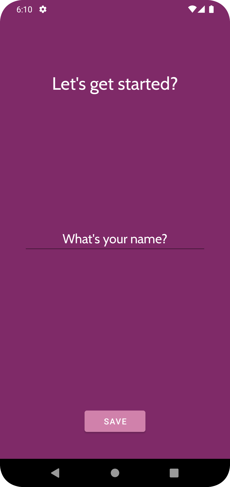
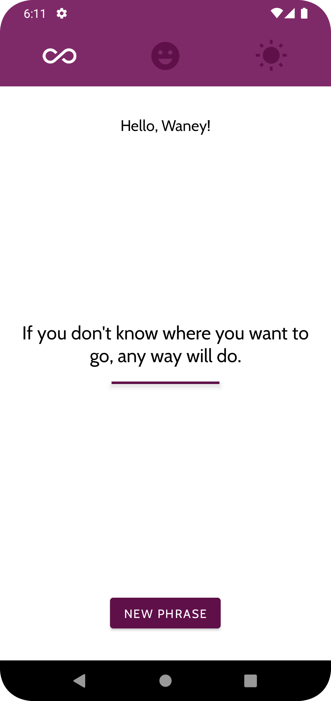

# Motivation

Motivation é um aplicativo para Android que exibe frases motivacionais para inspirar os usuários. Ele foi criado no curso de Desenvolvimento de Aplicativos Android usando Kotlin. Durante o curso, aprendi a estilização das activity e eventos de click, navegação entre activities, sharedPreferences, constantes, cliques no menu de frases, exibição de frases e internacionalização.

## Demonstração

# Instalação

- Clone este repositório.
- Abra o projeto no Android Studio.
- Conecte um dispositivo Android ao computador ou configure um emulador no Android Studio.
- Clique no botão "Run" no Android Studio para instalar e executar o aplicativo no dispositivo ou emulador.
    
# Como usar

Para usar o aplicativo Motivation, siga as etapas abaixo:

- Abra o aplicativo no seu dispositivo Android.
- Toque na tela para exibir uma nova frase motivacional.
- Toque no botão "Compartilhar" para compartilhar a frase motivacional com seus amigos ou redes sociais.
- Toque no botão "Menu" para selecionar uma categoria específica de frases motivacionais.
- Toque em "Configurações" no menu para alterar o idioma do aplicativo ou outras configurações.

# Contribuição

Se você quiser contribuir com o projeto Motivation, siga as etapas abaixo:

- Crie um fork deste repositório.
- Faça as alterações necessárias em sua própria cópia do projeto.
- Envie uma solicitação de recebimento para o repositório original, explicando as alterações que você fez.

# Licença

Este projeto está licenciado sob a Licença MIT.

# Créditos

Este projeto foi criado como parte do curso de Desenvolvimento de Aplicativos Android usando Kotlin, da Udemy. Agradeço ao instrutor e equipe da Udemy por fornecer os recursos e conhecimentos necessários para criar este aplicativo.
